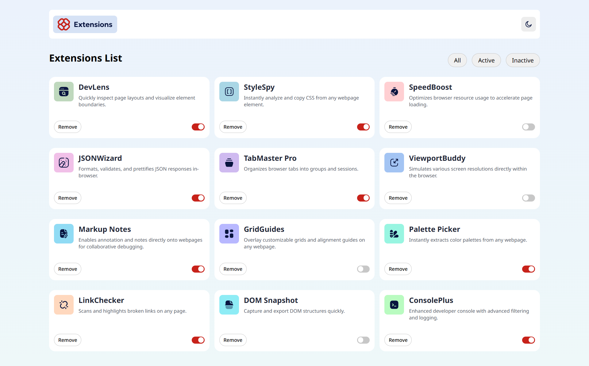
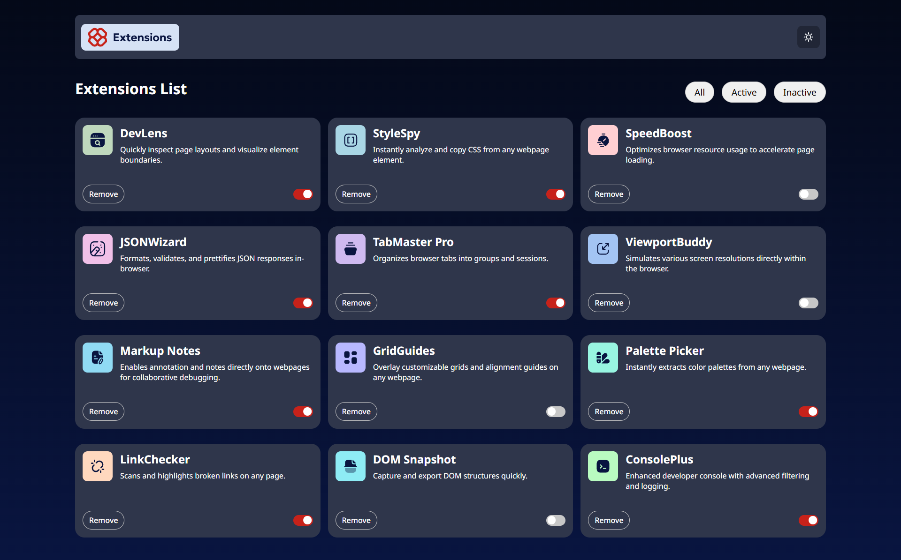

# Frontend Mentor - Browser extensions manager UI solution

This is a solution to the [Browser extensions manager UI challenge on Frontend Mentor](https://www.frontendmentor.io/challenges/browser-extension-manager-ui-yNZnOfsMAp). Frontend Mentor challenges help you improve your coding skills by building realistic projects. 

## Table of contents

- [Overview](#overview)
  - [The challenge](#the-challenge)
  - [Screenshot](#screenshot)
  - [Links](#links)
- [My process](#my-process)
  - [Built with](#built-with)
  - [What I learned](#what-i-learned)
  - [Continued development](#continued-development)
  - [Useful resources](#useful-resources)
- [Author](#author)
- [Acknowledgments](#acknowledgments)

**Note: Delete this note and update the table of contents based on what sections you keep.**

## Overview

### The challenge

Users should be able to:

- Toggle extensions between active and inactive states
- Filter active and inactive extensions
- Remove extensions from the list
- Select their color theme
- View the optimal layout for the interface depending on their device's screen size
- See hover and focus states for all interactive elements on the page

### Screenshot

- Desktop Design
- Resolution above 800px 

### Links

- Solution URL: [GitHub](https://github.com/nefariooo/extension-manager-ui.git)
- Live Site URL: [Netlify](https://magnificentthrush05-extension-manager.netlify.app/)

## My process

### Built with

- Started with HTML, built the structure
- Styled the HTML with CSS each element at a time
- First developed the solution for desktop
- Then, used Media Query to develop the mobile version
- Made the webpage interactive using JavaScript

### What I learned

Learned about fetch API in JS to retrieve data.

### Useful resources

- [Stack Overflow](https://stackoverflow.com/questions) - Best place to find the answer to every question even the  most basics one too.
- [W3 School](https://www.w3schools.com/css/default.asp) - Great website for CSS material and JS.
- [MDN Mozilla Developers](https://developer.mozilla.org/en-US/docs/Web/JavaScript) - Excellent and in-depth detail about frontend.

## Author

## Author

- Frontend Mentor - [@magnificent_thrush](https://www.frontendmentor.io/profile/magnificentthrush)

